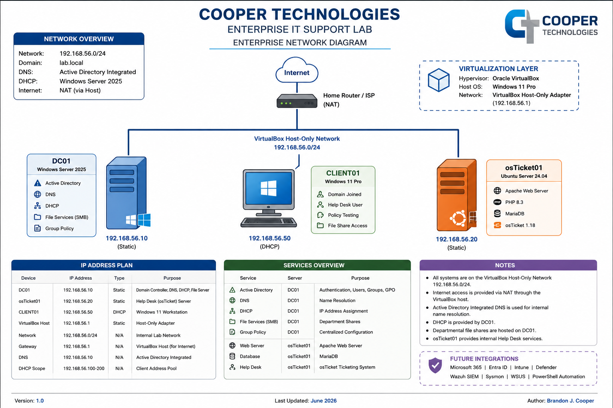

# Enterprise IT Support Lab


---

# Enterprise IT Infrastructure Project

This repository documents the design, deployment, administration, and day-to-day management of a production-inspired Enterprise IT environment.

Rather than building isolated labs, this project simulates an actual corporate IT department where systems are deployed, secured, documented, maintained, and supported exactly as they would be in a real organization.

The project is organized into multiple implementation sprints covering Active Directory, Windows Server administration, enterprise networking, file services, Group Policy, Help Desk operations, Microsoft 365 administration, PowerShell automation, security operations, and ticket management.

---

# Project Goals

✔ Build a complete Active Directory environment

✔ Deploy enterprise Windows infrastructure

✔ Implement DHCP and DNS

✔ Design enterprise Organizational Units

✔ Create realistic users and departments

✔ Configure enterprise file shares and NTFS permissions

✔ Deploy osTicket Help Desk

✔ Simulate Tier 1 & Tier 2 support

✔ Administer Microsoft 365

✔ Automate administrative tasks using PowerShell

✔ Produce professional documentation throughout the project

---

# Enterprise Environment

| Component | Technology |
|------------|------------|
| Hypervisor | Oracle VirtualBox |
| Domain Controller | Windows Server 2025 |
| Client Workstation | Windows 11 Enterprise |
| Linux Server | Ubuntu Server 24.04 |
| Active Directory | Windows AD DS |
| DNS | Active Directory Integrated |
| DHCP | Windows DHCP |
| File Services | SMB Shares |
| Help Desk | osTicket v1.18 |
| Automation | PowerShell |
| Documentation | GitHub |

---

# Enterprise Architecture

```
                         Internet
                             │
                    ┌─────────────────┐
                    │   VirtualBox    │
                    └─────────────────┘
                             │
                ┌────────────┴─────────────┐
                │                          │
         Windows Server 2025          Ubuntu 24.04
             DC01                     osTicket
                │                          │
                ├──────────────┐           │
                │              │           │
         Active Directory      │           │
                │              │           │
          DNS / DHCP           │           │
                │              │           │
          File Shares          │           │
                │              │           │
                └────── CLIENT01 ──────────┘
                    Windows 11
```

## Enterprise Network Diagram



---

# Repository Structure

```
Enterprise-IT-Support-Lab
│
├── Assets
├── Diagrams
├── Enterprise-Documentation
├── Incident-Reports
├── PowerShell
├── SOPs
├── Ticket-Walkthroughs
│
├── Sprint-01-Enterprise-Infrastructure
├── Sprint-02-Enterprise-Operations
├── Sprint-03-Help-Desk-Operations
├── Sprint-04-Security-Operations
├── Sprint-05-Cloud-Administration
├── Sprint-06-Automation
└── Sprint-07-Enterprise-Capstone
```

---

# Sprint Roadmap

| Sprint | Status |
|---------|--------|
| Sprint 1 – Enterprise Infrastructure | 🟢 In Progress |
| Sprint 2 – Enterprise Operations | ⚪ Planned |
| Sprint 3 – Help Desk Operations | ⚪ Planned |
| Sprint 4 – Security Operations | ⚪ Planned |
| Sprint 5 – Cloud Administration | ⚪ Planned |
| Sprint 6 – Automation | ⚪ Planned |
| Sprint 7 – Enterprise Capstone | ⚪ Planned |

---

# Skills Demonstrated

### Windows Server Administration

- Active Directory
- DHCP
- DNS
- Organizational Units
- Group Policy
- File Services
- NTFS Permissions
- SMB Shares

### Help Desk

- osTicket Administration
- User Provisioning
- Password Resets
- Ticket Workflow
- Account Lockouts
- User Support
- Troubleshooting

### Enterprise Administration

- Identity Management
- Access Control
- Documentation
- Change Management
- Standard Operating Procedures
- Incident Response

### Automation

- PowerShell
- Administrative Scripting
- User Automation
- Group Automation

---

# Documentation

| Document | Description |
|----------|-------------|
| Project Charter | Project scope and objectives |
| Documentation Index | Complete project navigation |
| Sprint Documentation | Step-by-step implementation |
| SOPs | Administrative procedures |
| Incident Reports | Troubleshooting scenarios |
| Ticket Walkthroughs | Help Desk simulations |

---

# Current Progress

✅ Domain Controller deployed

✅ Active Directory configured

✅ Enterprise Organizational Units created

✅ Department users created

✅ Security Groups configured

✅ DHCP configured

✅ DNS configured

✅ Enterprise file shares deployed

✅ NTFS permissions configured

✅ osTicket deployed

⬜ Microsoft 365 Integration

⬜ PowerShell Automation

⬜ Enterprise GPO Management

⬜ Help Desk Ticket Scenarios

⬜ Enterprise Security Hardening

---

# Screenshots

Project screenshots are organized within each sprint.

Example:

Sprint 01

- Active Directory
- DHCP
- DNS
- Enterprise OUs
- Department Shares
- NTFS Permissions
- osTicket
- Validation
- Troubleshooting

---

# Future Enhancements

- Microsoft 365 Administration
- Intune
- Entra ID
- Defender for Endpoint
- WSUS
- Wazuh SIEM Integration
- Windows Event Forwarding
- PowerShell Automation
- Enterprise Backup Strategy
- Vulnerability Management

---

# Author

**Brandon J. Cooper**

Enterprise IT Support Lab

2026

---

This repository is continuously updated as additional enterprise technologies are implemented. develop practical experience in Help Desk, System Administration, Networking, and Cybersecurity.
